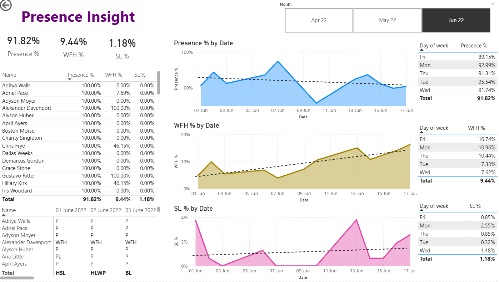

# 📊 Presence Insight Dashboard (Power BI)

## 🚀 Headline
**Power BI Dashboard for Employee Presence, WFH & Sick Leave Analysis**

---

## 📌 Overview
The **Presence Insight Dashboard** is an interactive Power BI report designed to analyze employee attendance patterns, including **office presence, work-from-home (WFH), and sick leave (SL)** trends.  
It enables HR teams and management to monitor workforce availability, identify behavioral trends, and support data-driven workforce planning.

---

## 🎯 Purpose of the Project
The key objectives of this dashboard are:
- To track **overall employee presence percentage**
- To analyze **WFH and Sick Leave trends over time**
- To compare attendance by **date and day of the week**
- To provide **employee-level attendance visibility**
- To build a **real-world HR analytics portfolio project**

---

## 🧰 Technologies Used
- **Power BI Desktop**
- **Power Query** (Data Cleaning & Transformation)
- **DAX (Measures & Calculations)**
- **Microsoft Excel / CSV** (HR Attendance Data)
- **GitHub** (Version Control & Hosting)

---

## 📂 Dataset Information
- **Source:** HR Attendance dataset (sample / anonymized)
- **Data Type:** Structured tabular data
- **Key Fields Include:**
  - Employee Name
  - Date
  - Attendance Status (P, WFH, SL)
  - Presence %
  - WFH %
  - SL %
  - Day of Week
  - Month

> 📌 *This dataset is used strictly for learning and portfolio demonstration purposes.*

---

## 📈 Key Dashboard Features
- **KPI Metrics**
  - Presence %
  - Work From Home (WFH) %
  - Sick Leave (SL) %

- **Trend Analysis**
  - Presence % by Date
  - WFH % by Date
  - SL % by Date

- **Day-wise Insights**
  - Attendance distribution by day of the week
  - Identification of high/low presence days

- **Employee-level View**
  - Individual attendance percentages
  - Daily attendance status table

- **Interactive Filters**
  - Month selector
  - Date-based slicing
  - Dynamic visuals

---

## 🖼️ Dashboard Screenshot

---

## 📂 Repository Contents

HR Presence Dashboard.pbix – Power BI dashboard file

HR-dashboard_sc.png – Dashboard screenshot

README.md – Project documentation

---

## 🖼 Dashboard Preview

## 🚀 How to Use

Clone or download this repository

Open HR Presence Dashboard.pbix in Power BI Desktop

Use slicers to filter by month or employee

Analyze trends across presence, WFH, and leave patterns

---

## 📊 Business Insights

Office presence remains consistently above 90%

WFH trend shows a gradual increase over time

Sick leave percentage remains low and stable

Mondays and Tuesdays show higher presence compared to Fridays

---

## 🎯 Learning Outcomes

Built an HR analytics dashboard using Power BI

Applied DAX for percentage calculations

Used trendlines for pattern identification

Designed a clean, HR-focused reporting layout

---

## 📌 Future Enhancements

Add late login & early logout analysis

Department-wise presence tracking

Integration with live HR systems

Predictive absenteeism trends

---

## 🙋‍♀️ Author

Shruti Adsul
📘 BE – VLSI Design & Technology
📊 Data Analytics & Power BI Enthusiast

⭐ If you find this project useful, please ⭐ star the repository!
